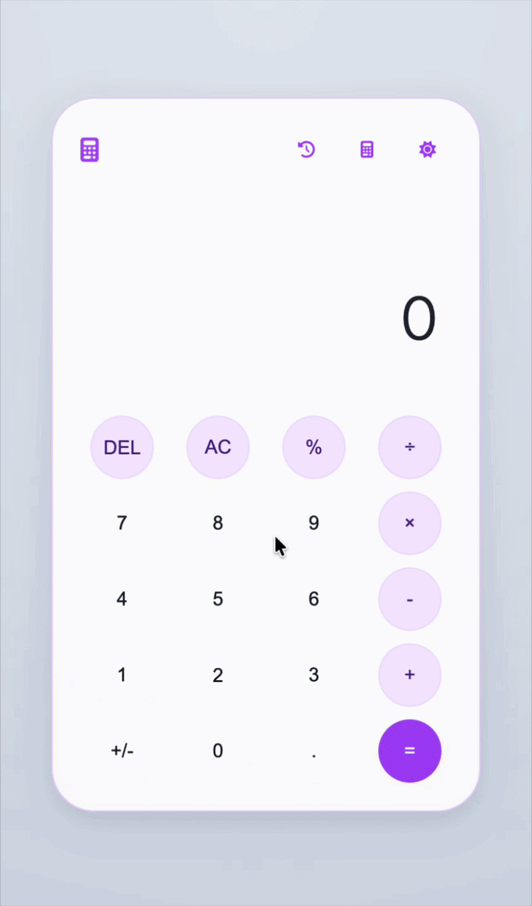

<div align="center">
<br>

# Smart Calculator 

<p align="center">
  
  &nbsp;
  
  &nbsp;
  
  &nbsp;
  
</p>

</div>

---

<p align="center">A modern and responsive calculator built to practice logic, HTML, CSS, JavaScript, and UI/UX.</p>

---

## ✦ About the Project

<table>
<tr>
<td width="42%" valign="center">



</td>
<td width="58%" valign="top">

The **Smart Calculator** is a project I built to practice and deepen my knowledge in HTML, CSS, and JavaScript, and, most importantly, to challenge myself to create something beyond the basics.

My goal was to build a modern, fluid, and enjoyable interface, combining programming logic with careful attention to visual details and user experience.

I also wanted to turn this project into something that reflects my commitment to organization, responsiveness, design, and hands-on front-end development.

<br>

**Highlights:**

&nbsp;&nbsp;`🌗` &nbsp;Dark and light theme with smooth transition <br>
&nbsp;&nbsp;`🕐` &nbsp;Operation history panel with scroll <br>
&nbsp;&nbsp;`💲` &nbsp;Built-in currency conversion mode for 7 currencies<br>
&nbsp;&nbsp;`✦` &nbsp;UI with glassmorphism and visual effects<br>
&nbsp;&nbsp;`📱` &nbsp;Responsive layout for any screen size<br>
&nbsp;&nbsp;`⚡` &nbsp;Fluid animations and microinteractions<br>

<br>

[](https://smart-calculator-wine.vercel.app)


</td>
</tr>
</table>

---

## ✦ Running the Project

### Prerequisites

- [Git](https://git-scm.com/) installed on your machine
- [VS Code](https://code.visualstudio.com/) cas your code editor
- Extensão [Live Server](https://marketplace.visualstudio.com/items?itemName=ritwickdey.LiveServer) extension for auto-reload (optional)

<br>

### Installation

**1. Clone the repository**
```bash
git clone https://github.com/leticiatalmeida/smart-calculator.git
```

**2.  Navigate to the project folder**
```bash
cd smart-calculator
```

**3. Open in VS Code**
```bash
code .
```

**4. Run the project**

With Live Server: right-click `index.html` → **Open with Live Server**

Without the extension: open `index.html` directly in your browser.

> No dependencies need to be installed — the project runs with native files only.

<br>

---

## ✦ Technologies

<div align="center">

<br>


&nbsp;

&nbsp;


<br>

</div>

---

## ✦ Tools

<div align="center">

<br>


&nbsp;


<br>

</div>

---

## ✦ Author

<br>

<div align="center">


<br>

[](https://github.com/leticiatalmeida)
&nbsp;
[](https://www.linkedin.com/in/almeidale/)

</div>

<br>

---

## ✦ License

This project is licensed under the [MIT License](./LICENSE).

You are free to use, copy, modify, and distribute it (including for commercial purposes) as long as you keep the original credits.

---

<div align="center">

<br><br>


<br>

*A simple project that took every detail seriously.*

<br>

</div>
